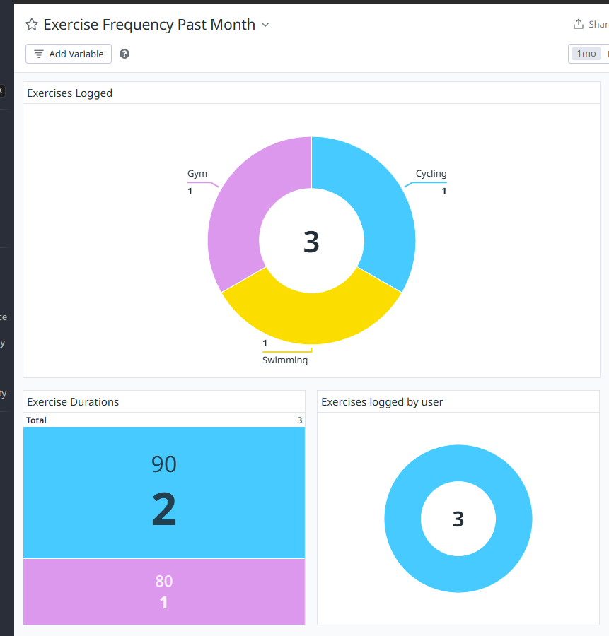

# MLA Fitness App

A simple and interactive fitness tracking application built with multiple microservices and programming languages. This application allows users to track their exercises and monitor their progress over time.

The Activity Tracking functionality uses the MERN stack (MongoDB, Express.js, React, Node.js), the Analytics_v2 service uses Python/Flask and the Authentication Microservice using Java.


### Current Features

- User registration for personalized tracking
- Log various types of exercises with descriptions, duration, and date
- See weekly and overall statistics
- Interactive UI with Material-UI components
- Real-time data persistence with MongoDB
- AI analysis of exercise descriptions to provide a motivational message

### Prerequisites

- Node.js
- MongoDB
- npm or yarn
- Python Flask
- Java 8
  (all already installed in the devcontainer)

### Building entire project with Docker (+ starting containers up)

<details>
<summary>Toggle for commands</summary>

```sh
docker-compose up --build
```

### Start existing containers (no rebuild of images)

```sh
docker-compose up
```

#### Spinning up a single service

```sh
docker-compose up [servicename]
```

#### Shutting down a service

```sh
docker-compose down [servicename]
```

</details>

## Development without using Docker-Compose

<details>
<summary>Toggle for commands</summary>

#### Running Node.js Activity Tracker

```sh
cd activity-tracking
npm install
nodemon server
```

#### Running Flask application

```sh
cd analytics_v2
flask run -h localhost -p 5050
```

#### Running Java application

```sh
cd authservice
./gradlew clean build
./gradlew bootRun
```

#### Start the Frontend

```sh
cd frontend
npm install
npm start
```

#### spin up MongoDB without docker-compose:

```
docker run --name mongodb -d -p 27017:27017 -v mongodbdata:/data/db mongo:latest
```

### Connect to MongoDB

```
mongosh -u root -p cfgmla23 --authenticationDatabase admin --host localhost --port 27017
```

show registered activities:

```
db.exercises.find()
```

show registered users:

```
db.users.find()
```

</details>

## Deployment

<details>
<summary>Toggle for commands</summary>

The application is containerized using Docker and can be deployed on any platform that supports Docker containers. For AWS deployment, a GitHub Actions pipeline is configured for CI/CD.

</details>

## Monitoring and Alerting

We have made use of Datadog, which uses an api key to push logs from your local containers to datadog. To use this, you need to:

- Create a datadog account - https://app.datadoghq.eu/help/quick_start
- Obtain an API key
- Add this to the .env file
- Rebuild your docker containers

You will then be able to see the logs in Datadog, and create dashboards.

The following dashboard has been exported and can be found at `resources/datadog/ExerciseFrequencyPastMonth--2024-11-28T15_41_02.json`

<details>
  <summary>Expand to see dashboard screenshot</summary>



</details>

## Running tests

<details>
<summary>Toggle for commands</summary>

Frontend

```sh
cd frontend
npm i
npm run test
```

Activity-tracking Cypress tests

```sh
cd activity-tracking
npm i
npm run cy:run
```

</details>

## Pa11y accessibility report

Create a report of possible a11y issues using pa11y.
More urls can be added in the pa11y.js file

```sh
cd frontend
npm run test-pa11y
```
