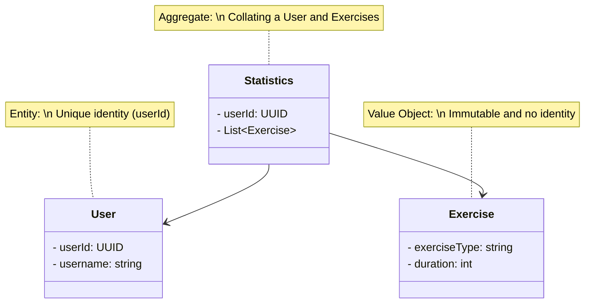

# Analytics V2 
A rewrite of the existing analytics service. 

[//]: # (To render the above, install a mermaid plugin)

## How to run: 

    
As an independent service 

- Navigate to app.py 
- Run this file

    
Using docker 

- `docker-compose build analytics_v2`
- `docker-compose up analytics_v2 -d`

You may then access at http://localhost:5051/ 

## Development Notes 
* This app will be running on 5051, so take note to specify this during development 

[//]: # (Todo add these instructions  )