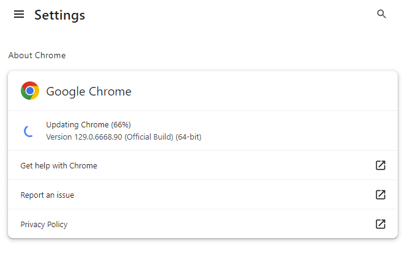
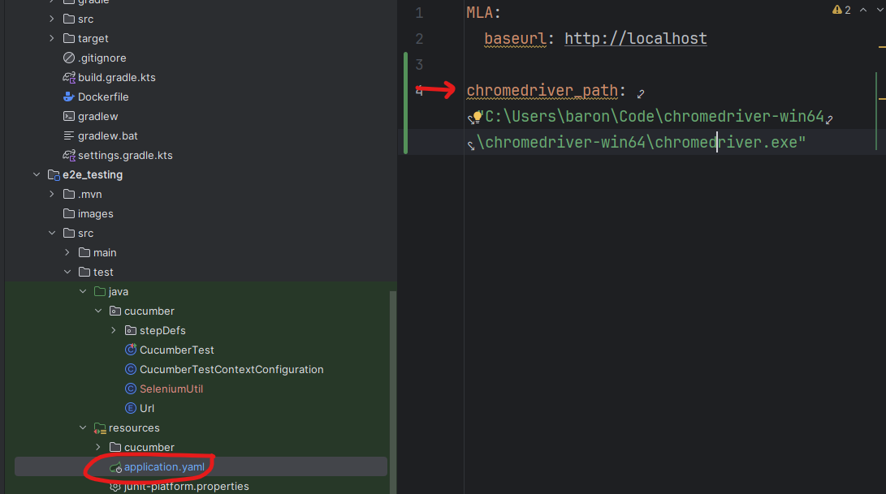

# Testing application for the MLA fitness app 
An app to test the MLA fitness app in a black box manner, from a user's perspective.

## How to use 
1. Follow the instructions in the MLA-app README to run the application 
2. Install the Cucumber plugin for IntelliJ
3. Download & setup ChromeDriver (for selenium, follow below steps)
4. Set the environment variable `CHROME_DRIVER_PATH` on your device, with the path to the chrome driver executable 
4. Run CucumberTest class

### Downloading ChromeDriver
* find out your chrome version at chrome://settings/help, e.g. mine is 129.0.6668.90
  
* Download the matching ChromeDriver (search ChromeDriver -> follow instructions on https://developer.chrome.com/docs/chromedriver/downloads)
* Extract this download (as you do with normal downloads) 
* Copy the path and add it to your (test) application.yaml file  

### Cucumber Tags
Add tags in `src/test/resources/junit-platform.properties`
* Currently, have `@ignore` configured to not run a test 